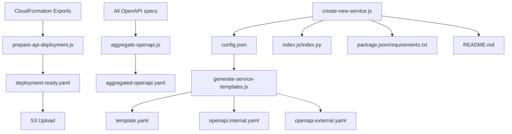

# Scripts Directory

This directory contains automation scripts for the Truss Annotation Data Service Layer. These scripts help create, configure, and deploy microservices with standardized patterns and minimal manual configuration.

## Overview

The scripts follow a **config-driven approach** where `config.json` is the single source of truth for each service. All templates, deployment configurations, and API specifications are generated automatically from this configuration.

## Scripts

### 1. `create-new-service.js` - Service Scaffolding

**Purpose**: Creates a complete new service from scratch with all required files and proper structure.

**Usage**:

```bash
node scripts/create-new-service.js <parent-folder> <service-name> [options]
```

**Options**:

- `--runtime <nodejs|python>` - Choose runtime (default: nodejs)
- `--description "text"` - Service description
- `--security <modes>` - Comma-separated security modes: `public,cognito,api_key,service_role`
- `--database` - Enable database connection
- `--vpc` - Deploy in VPC
- `--memory <number>` - Memory in MB (default: 512)
- `--timeout <number>` - Timeout in seconds (default: 30)

**Examples**:

```bash
# Basic Node.js service with API key auth
node scripts/create-new-service.js services knowledge

# Python service with Cognito auth and database
node scripts/create-new-service.js services user-profile --runtime python --security cognito --database

# Full-featured internal service
node scripts/create-new-service.js services internal-api --security api_key,service_role --vpc --database --memory 1024
```

**Files Created**:

```
services/<service-name>/
├── config.json          # Complete service configuration (single source of truth)
├── index.js|index.py    # Handler with multi-auth support and routing
├── package.json|requirements.txt  # Dependencies
└── README.md            # Service documentation
```

**Generated Features**:

- ✅ Multi-authentication support (public, Cognito, API key, service role)
- ✅ Database connection setup (optional)
- ✅ VPC configuration (optional)
- ✅ CORS handling for all auth methods
- ✅ Error handling and logging
- ✅ Route handling with path parameter extraction
- ✅ Complete documentation

---

### 2. `generate-service-templates.js` - Template Generation

**Purpose**: Generates CloudFormation and OpenAPI templates from service `config.json` files.

**Usage**:

```bash
node scripts/generate-service-templates.js <service-directory>
```

**Examples**:

```bash
# Generate templates for knowledge service
node scripts/generate-service-templates.js services/knowledge

# Generate templates for any service
node scripts/generate-service-templates.js services/knowledge
```

**Input**: Reads from `<service-directory>/config.json`

**Files Generated**:

```
services/<service-name>/
├── template.yaml         # CloudFormation deployment template
├── openapi.internal.yaml # Internal API Gateway OpenAPI specification
└── openapi.external.yaml # External API Gateway OpenAPI specification
```

**Template Features**:

#### `template.yaml` (CloudFormation):

- ✅ Lambda function configuration from `config.deployment`
- ✅ IAM roles and permissions based on `config.database` and `config.deployment.vpc_config`
- ✅ VPC configuration (conditional)
- ✅ Database permissions (conditional)
- ✅ API Gateway permissions
- ✅ Service role invoke permissions (conditional)
- ✅ API key creation (conditional)
- ✅ Environment variables from all config sections

#### `openapi.internal.yaml` and `openapi.external.yaml` (API Gateway):

- ✅ API endpoints from `config.api.endpoints`
- ✅ Security schemes based on `config.access` configuration
- ✅ CORS configuration from `config.access.auth_config`
- ✅ Lambda integrations with stage variables
- ✅ Request/response schemas
- ✅ Multiple authentication options (OR relationship)

---

### 3. `migrate-configs.js` - Config Migration

**Purpose**: Migrates services from the old config structure to the new simplified structure.

**Usage**:

```bash
node scripts/migrate-configs.js
```

**What it does**:

- ✅ Analyzes existing `config.internal.json` and `config.external.json` files
- ✅ Determines access configuration based on security modes
- ✅ Creates unified `config.json` with `access` section
- ✅ Removes old config files
- ✅ Preserves all auth configuration

---

### 4. `aggregate-openapi.js` - OpenAPI Aggregation

**Purpose**: Aggregates OpenAPI specifications from all services into a single API Gateway specification.

**Usage**:

```bash
node scripts/aggregate-openapi.js --stage=<stage>
```

**Features**:

- ✅ Combines all service OpenAPI specs
- ✅ Resolves Lambda ARN placeholders
- ✅ Generates complete API Gateway specification
- ✅ Supports both internal and external deployments

---

### 5. `prepare-api-deployment.js` - API Deployment Preparation

**Purpose**: Prepares API Gateway deployment by resolving Lambda ARNs and creating deployment-ready specifications.

**Usage**:

```bash
node scripts/prepare-api-deployment.js --stage=<stage>
```

**Features**:

- ✅ Fetches Lambda ARNs from CloudFormation exports
- ✅ Replaces stage variables with actual ARNs
- ✅ Creates deployment-ready OpenAPI specifications
- ✅ Uploads to S3 for API Gateway deployment

---

### 6. `deploy-service.js` - Individual Service Deployment

**Purpose**: Deploys a single service to AWS.

**Usage**:

```bash
node scripts/deploy-service.js <service-directory> [options]
```

**Features**:

- ✅ Packages and uploads service code
- ✅ Deploys CloudFormation stack
- ✅ Updates service registry
- ✅ Supports different stages

---

### 7. `deploy-all-services.js` - Bulk Service Deployment

**Purpose**: Deploys all services in parallel.

**Usage**:

```bash
node scripts/deploy-all-services.js [options]
```

**Features**:

- ✅ Discovers all services automatically
- ✅ Deploys services in parallel
- ✅ Handles dependencies
- ✅ Provides deployment status

---

### 8. `generate-service-registry.js` - Service Registry Generation

**Purpose**: Generates a comprehensive registry of all services and their endpoints.

**Usage**:

```bash
node scripts/generate-service-registry.js
```

**Features**:

- ✅ Discovers all services automatically
- ✅ Extracts endpoint information
- ✅ Generates service documentation
- ✅ Creates machine-readable registry

---

## Workflow Integration

### ⚠️ IMPORTANT: Local vs CI/CD Scripts

**ONLY run these scripts locally:**
- `copy-utils.js` - Sync shared utilities to services
- `generate-service-templates.js` - Generate templates from config.json

**DO NOT run these locally (handled by GitHub Actions):**
- `deploy-service.js` - Service deployment (requires AWS credentials)
- `deploy-all-services.js` - Bulk deployment (requires AWS credentials)
- `aggregate-openapi.js` - OpenAPI aggregation (handled in CI/CD)
- `prepare-api-deployment.js` - API deployment prep (handled in CI/CD)

All deployment is automated via `.github/workflows/deploy-services.yaml` when you push to the repository.

### New Service Creation Workflow:

```bash
# 1. Create new service
node scripts/create-new-service.js services knowledge --security api_key --database

# 2. Copy utils to the new service
node scripts/copy-utils.js knowledge

# 3. Customize config.json as needed
vim services/knowledge/config.json

# 4. Implement business logic
vim services/knowledge/index.js

# 5. Generate deployment templates
node scripts/generate-service-templates.js services/knowledge

# 6. Commit and push - GitHub Actions will deploy automatically
git add . && git commit -m "Add knowledge service" && git push
```

### Existing Service Update Workflow:

```bash
# 1. Update configuration
vim services/knowledge/config.json

# 2. Regenerate templates
node scripts/generate-service-templates.js services/knowledge

# 3. If you updated shared utilities, sync them
node scripts/copy-utils.js knowledge

# 4. Commit and push - GitHub Actions will deploy automatically
git add . && git commit -m "Update knowledge service config" && git push
```

## File Dependencies



## Benefits

### For Developers:

- **Fast Service Creation**: Complete service in seconds
- **Consistent Structure**: All services follow same patterns
- **Multi-Auth Built-in**: No need to implement auth from scratch
- **Documentation Generated**: README and API docs created automatically

### For Operations:

- **Single Source of Truth**: All config in one place
- **Automated Templates**: No manual CloudFormation writing
- **Deployment Ready**: Generated templates work with existing pipelines
- **Standardized**: All services deploy the same way

### For Maintenance:

- **Config-Driven**: Change behavior by updating config
- **Generated Templates**: Reduce manual errors
- **Consistent Patterns**: Easy to understand and debug
- **Self-Documenting**: Clear what each service does

## Script Dependencies

**For local development (copy-utils, generate-service-templates):**

- Node.js packages: `js-yaml`, `glob` (install with `npm install js-yaml glob`)
- No AWS credentials needed

**For CI/CD deployment (handled by GitHub Actions):**

- AWS CLI and credentials (configured in GitHub Actions secrets)
- CloudFormation and S3 access

## Example Service Types

### Public Knowledge Service:

```bash
node scripts/create-new-service.js services knowledge --security public,cognito,api_key --database --vpc
```

### Private Internal Service:

```bash
node scripts/create-new-service.js services internal-knowledge --security api_key,service_role --database --vpc --memory 1024
```

### User-Facing Service:

```bash
node scripts/create-new-service.js services user-dashboard --security cognito --runtime python
```

### Lightweight Utility:

```bash
node scripts/create-new-service.js services health-check --security public --memory 256 --timeout 10
```

Each type gets the appropriate configuration, dependencies, and documentation automatically generated.
